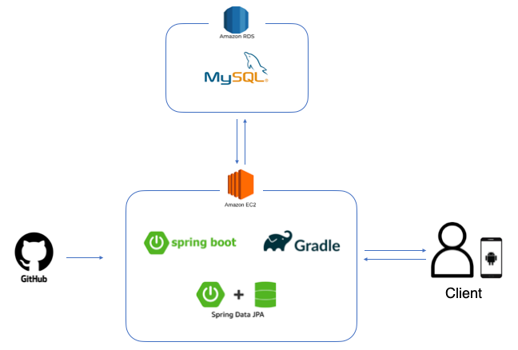
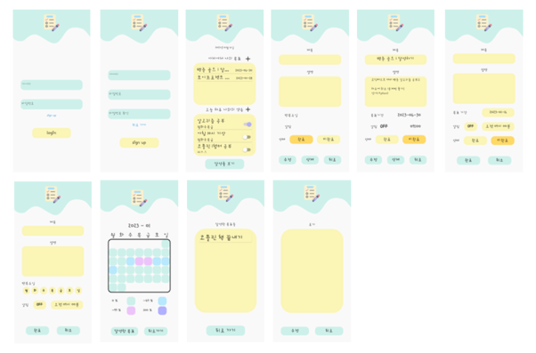
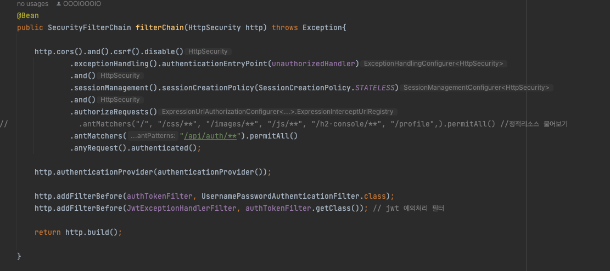
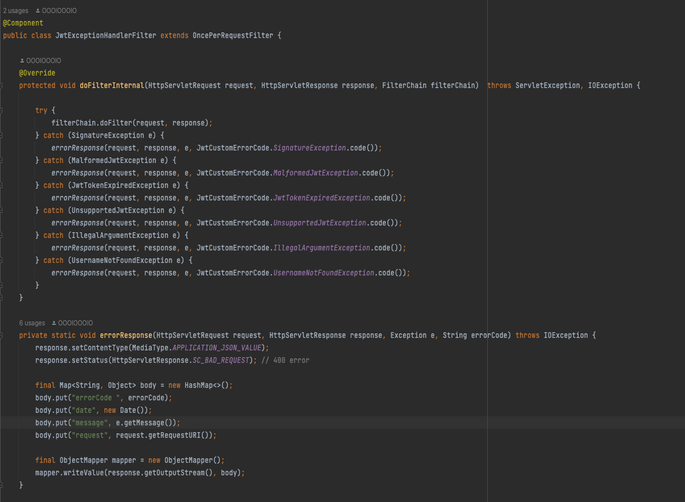
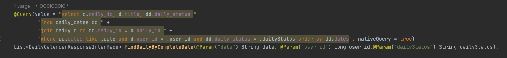
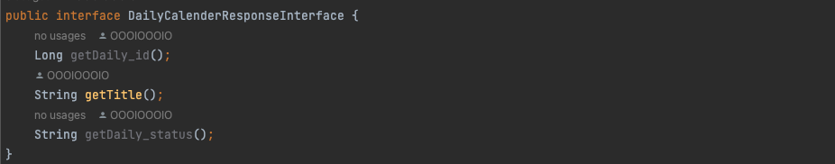

# Goal-tracker-server

## 개요
> 단기, 장기 목표를 세워 맞춤 목표를 설정할 수 있는 목표 달성 애플리케이션입니다. 목표 완료 시 다이어리를 통해 회고를 작성할 수 있습니다. 무엇보다 캘린더를 이용하여 해당 날짜에 달성한 목표의 개수를 다양한 색상으로 표현하여 목표 달성을 위한 동기부여를 제공했습니다.
>   Google play store에 애플리케이션을 출시하여 약 한달 정도 운영하며 약 50명의 유저를 확보했습니다.

## 역할 및 기간
- **김성호**
  - **Backend**
- **권하준**
  - **Frontend**
- **기간 : 2022.12.19 ~ 2022.12.30**
 

## Skills
- **Java 11**
- **Gradle**
- **Spring Boot**
- **Spring Security**
- **Spring Data JPA**
- **MySQL**
- **AWS EC2, RDS**
- **Layered Architecture**
- **RESTfu API**
 

## Architecture

 

## ERD

 

## API 명세서
[API 명세서 확인하기](https://github.com/OOOIOOOIO/Goal-tracker-server/wiki/API-%EB%AA%85%EC%84%B8%EC%84%9C.md)

 

## 주요 Function
- **로그인 및 회원가입 API 개발**
  - **form 방식**
  - **토큰 방식 : Access token(JWT), Refresh token(UUID)으로 관리**
- **단기 목표 API 개발**
  - **단기 목표 CRUD 기능**
- **장기 목표 API 개발**
  - **장기 목표 CRUD 기능**
  - **완료한 장기 목표 제공 기능**
- **일기 API 개발**
  - **일기 CRUD 기능**
- **캘린더 API 개발**
  - **1달 단위로 완료한 목표 제공 기능**
- **메인 화면 API 개발**
  - **1달 단위로 단기 및 장기 목표 제공 기능**
- **AWS EC2, RDS를 통한 서버 배포**
 

## Screenshot

 

## Code

#### Security filter chain

- **문제상황**
  - Security filter에 JWT 검사용 filter를 등록하였는데, 여기서 예외가 발생할 경우 Spring Context까지 전파되는 것이 아닌 바깥에서 종료되는 것을 확인했습니다.
- **해결방법 및 실행**
  - 이를 해결하고자 Security filter chain에 예외처리 필터를 등록하여 바로 response할 수 있게 구현했습니다.
- **성과**
  - 이를 통해 Spring Security filter chain에 대해 이해할 수 있었고, Spring의 예외처리에 대해 더 깊이 이해할 수 있었습니다.

 

#### JPA Projection 사용

- **문제상황**
  - Entity를 조회할 때 필요한 속성만 네이티브 쿼리를 통해 가져오고 싶었습니다.
- **해결방법 및 실행**
  - JPA Closed Projection을 이용해 가져오고 싶은 속성만 조회하여 쿼리 최적화할 수 있었습니다.
- **성과**
  - 이를 통해 JPA의 Projection + 네이티브 쿼리를 사용하는 법을 습득할 수 있었고 다양한 방법으로 데이터를 조회할 수 있다는 것을 깨달았습니다.

 

## 회고
> 앱 개발자와 협업을 해보았다. API 명세서 작성, 예외처리부터 기획, 디자인까지 같이 고민도 하고 얘기하면서 재밌게 한 것 같다.
>  역시 Spring Data JPA는 간단한 CRUD, 페이징, 정렬 등에 유용한 것 같다.
>  Spring Security를 제대로 써본 것은 처음이였다. Spring Security에 대해 많이 찾아보고 예외처리 방식에 대해 해메서 그런지 Security 사용 실력도 조금 늘은 것 같다.
>  드디어 AWS EC2, RDS를 사용해 실제 서버 배포를 경험해보았다. 또한 Google play store에 출시해 직접 운영해보면서, 사용자들이 실제로 사용하는 것을 보니 감회가 새로웠다. 

### 아쉬웠던 점
> 기능적인 면을 보면 일반적인 CRUD가 대부분이다. 다음엔 조금 더 복잡하고 재밌는 설계와 구현을 해보고 싶다.
>  나중엔 대용량 트래픽 서비스를 운영하며 여러 문제상황을 겪어보고 싶다.
